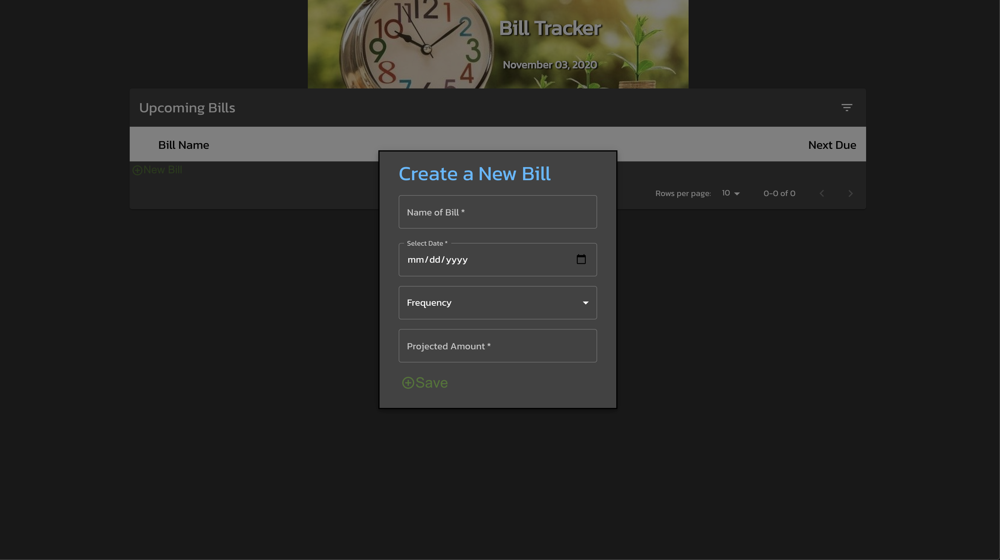
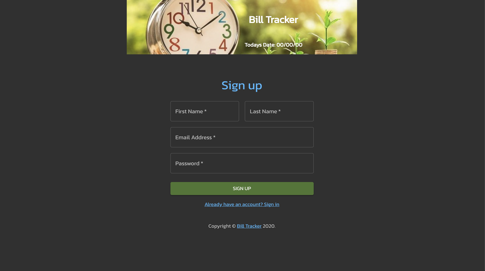
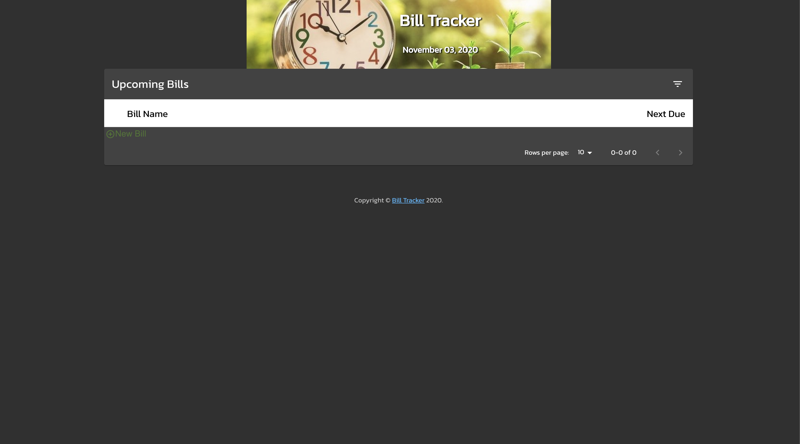

# BILL TRACKER

## Description
Bill Tracker is a web-based bill tracking application that allows users to keep a log of monthly bills. Users have the ability to create an account, create and track bills by date. Active users will maintian an 

## Screen Shots

## Main Photo

## Screen Shots

| | |
|:-------------------------:|:-------------------------:|
| screen shot 1|  screen shot 2|
| screen shot 3|  screen shot 4|

## Technology
* [MongoBD](https://www.mongodb.com/)
* [Express](https://www.npmjs.com/package/express)
* [Heroku](https://devcenter.heroku.com/categories/reference)
* [Node.js](https://nodejs.org/en/)
* [npmjs](https://docs.npmjs.com/)
* [HTML](https://developer.mozilla.org/en-US/docs/Web/HTML)
* [CSS](https://developer.mozilla.org/en-US/docs/Web/CSS)
* [Boostrap](https://getbootstrap.com/)
* [Favicon](https://favicon.io/favicon-converter/)
* [Mongoose](https://mongoosejs.com/docs/)
* [WAMG](https://app-manifest.firebaseapp.com/)

## Installation

### License  
   *MIT License*

## Authors
- [Haley Myers](https://github.com/haleynmyers)
- [Khalil Goldstein](https://github.com/KelalArrzenai)
- [Chris Reed](https://github.com/cr31293)
- [Payton Banks](https://github.com/paytonbanks)

## Project Site
*Link:*
[Bill Tracker]()